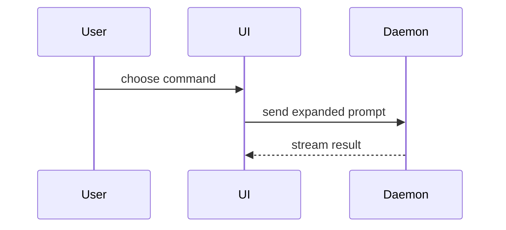

Build the PR body from the actual change, not from memory of the conversation. Read `git diff <base>...HEAD` and `git log <base>..HEAD` first.

Use this template for writing the PR body:

```markdown
## Summary

<one sentence: why this change exists>

<diagram, diff-sketch, or tree>

Closes #<issue>

## Evidence

| Before | After |
|---|---|
| <screenshot/output/failing test run> | <screenshot/output/passing test run> |

## Merge Danger

**Door:** <one-way or two-way>

<optional: description>

**Blast Radius:** <none | file | feature | shared | users | data>

<optional: realistic ramifications of merge>
```

## Sections

Skip all preambles and keep prose brief. Use the user's domain language from `GLOSSARY.md` at the repo root; if it doesn't exist, skip this silently.

### Summary

Open with one sentence of motivation: the problem or goal, not a restatement of the diff. Link the issue it resolves (`Closes #123`) when one exists; omit the line otherwise.

Then pick the smallest view that makes the key point clear.

- Show logic or an algorithm as pseudocode:

```text
on(save)
  if content is unchanged
    return cached result
  write new content
  return fresh result
```

- Show runtime control flow as a call tree:

```text
submitForm
  createSession
    persistPrompt
    launchAgent
  navigateToSession
```

- Show UI structure as a component tree, including state and module boundaries that matter:

```text
<SessionPage> (apps/example/src/routes/session.tsx)
  useSessionEvents()
  <SessionToolbar>
    <RunSkillButton> (packages/ui)
```

- Show file responsibility or a broad refactor as a shallow file tree:

```text
src/
├── commands/       # parses user actions
├── sessions/       # owns session state
└── transport/      # sends API requests
```

- Show component interaction, control flow, or data flow with Mermaid:



- Use `diff` when the point is what changes and the surrounding shape already exists. Match the diff shape to the topic.

For a component change:

```diff
 <SessionPage>
   useSessionEvents()
   <SessionToolbar>
+    <RunSkillButton />
   <SessionTimeline>
+    <SkillResultCard />
```

For a file-layout change:

```diff
 src/
 ├── commands/
+│   └── show-me.ts       # expands the slash command
 ├── sessions/
-└── transport.ts
+└── transport/
+    ├── client.ts
+    └── stream.ts
```

For a call-tree or call-stack change:

```diff
 submitForm
   createSession
     persistPrompt
+    expandSkillMention
     launchAgent
   navigateToSession
+    subscribeToEvents
```

For a state or control-flow change:

```diff
 on(save)
-  write content
+  if content is unchanged
+    return cached result
+  write new content
+  invalidate cache
```

- Show the whole block when most of it is new, when omitted context would hide ownership or order, or when the reviewer needs a copyable target shape:

```ts
function expandSkill(command: string): string {
    const skillName = command.slice(1);
    return `use the ${skillName} skill`;
}
```

#### Guidance

Place each visual next to the short text it supports. Keep only the calls, files, props, states, and boundaries a reviewer needs to understand the change and judge its risk.

You may use one of these, you may use several, it is unlikely you will use all of them. Use your judgement and don't overwhelm the reviewer.

### Evidence

Concrete evidence that the change works. Show a before and after.

Screenshots are S-tier - when the environment is set up for it and the change is visual.

Execution-based evidence is A-tier. Test results, console output. Name the test that failed before and passes after, and show its key assertion. Use pseudocode if the real test is noisy.

When there is no meaningful before and after (docs-only, pure refactor, config), drop the table and state that plainly with what you did run, e.g. "Refactor, no behaviour change; existing suite passes (`npm test`)". Never invent evidence.

### Merge Danger

Describe whether it's a one-way or two-way door. You can walk back through two-way doors, but not one-way doors. A PR that is cheap to roll back is lower risk. Changes that involve destructive actions or hard-to-reverse decisions are one-way doors, for example:

- DB migrations that drop or transform data
- Public API or schema changes that consumers depend on
- Published packages or releases
- Sent emails, notifications, or webhooks
- Deleted files or data

A feature flag turns most changes into two-way doors - say so if one guards the change.

The blast radius answers "if this breaks, what breaks?". Pick one from the scale, ordered smallest to largest; if several apply, pick the highest:

- **none** - no runtime effect (docs, comments, tests only)
- **file** - a single function or file
- **feature** - one package, service, or feature area
- **shared** - shared code used across many areas
- **users** - visible behaviour or UI changes for end users
- **data** - stored data or its shape can change

Then list the realistic ramifications, not every conceivable one. Examples are layout shift, breakages for consumers, mobile responsiveness, etc.
